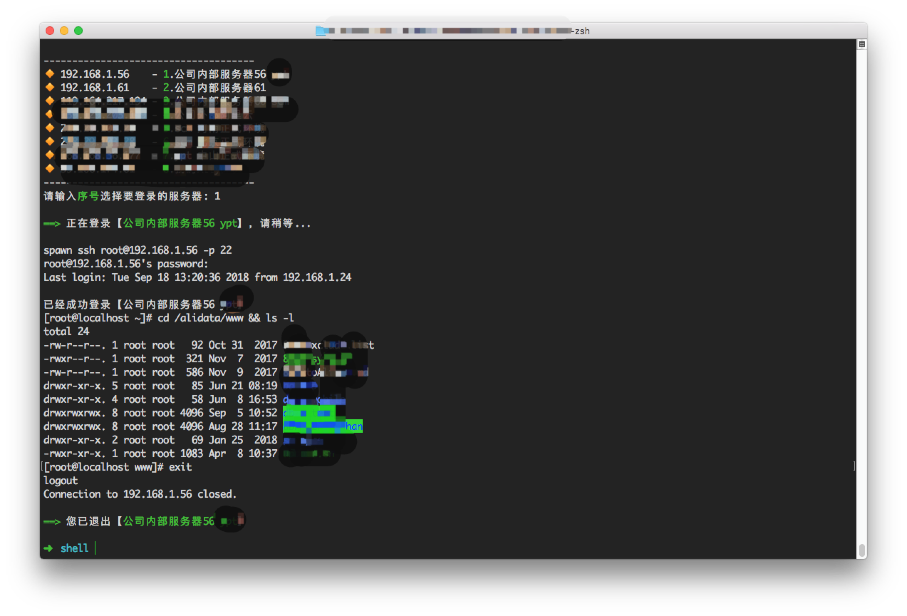
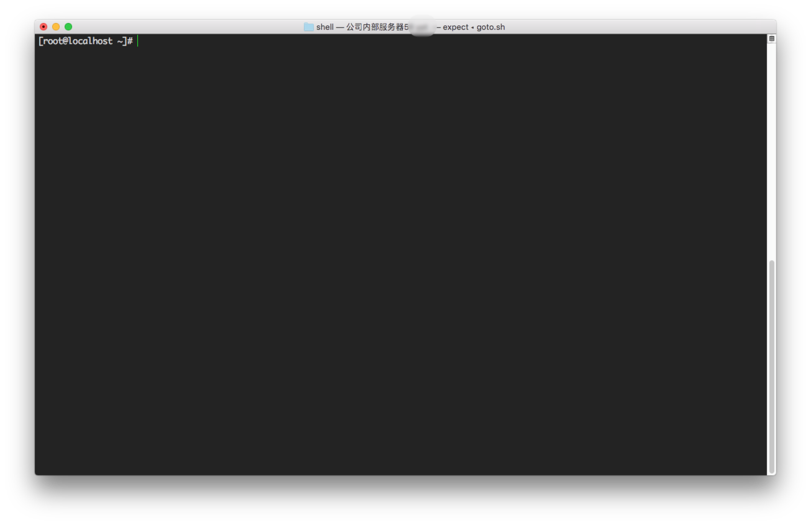

SSH 自动登录脚本
---

### 执行效果预览





### 如何使用当前脚本


1. `git clone https://github.com/whorusq/shell-ssh-autologin.git`
2. `cd shell-ssh-autologin`
3. 修改 goto.conf ，追加服务器列表
4. 赋予脚本可执行权限 `sudo chmod u+x goto.sh goto.ex`
5. 使用
	- 方式一：`./goto.sh`
	- 方式二：将 goto 加入当前用户全局使用

		```bash
		➜  ~ echo "alias goto=\"$PWD/goto.sh\"" >> ~/.zshrc
		➜  ~ source ~/.zshrc
		➜  ~ goto
		```

### 常见问题

#### 提示没有 expect 或 spawn 命令

当前脚本主要基于 expect 使用 spawn 实现。

Expect 是一个用来处理交互的工具，通常用于需要手动输入数据的场景，可在脚本中使用 Expect 来实现自动化。

首先使用以下命令检查 expect 是否已安装：

```
➜  whereis expect
/usr/bin/expect
```

如果没有安装，请按照以下步骤：

1. 安装 expect 的依赖 tcl

	```
	➜  wget https://sourceforge.net/projects/tcl/files/Tcl/8.4.19/tcl8.4.19-src.tar.gz
	➜  tar zxvf tcl8.4.19-src.tar.gz
	➜  cd tcl8.4.19/unix && ./configure
	➜  make
	➜  make install
	```
2. 安装 expect

	```
	➜  wget http://sourceforge.net/projects/expect/files/Expect/5.45/expect5.45.tar.gz
	➜  tar zxvf expect5.45.tar.gz
	➜  cd expect5.45
	➜  ./configure --with-tcl=/usr/local/lib --with-tclinclude=../tcl8.4.19/generic
	➜  make
	➜  make install
	➜  ln -s /usr/local/bin/expect /usr/bin/expect
	```

#### 特殊字符转义

如果密码中有特殊字符，需要做转义处理，否则使用 expect 的 send 语法是无法发送成功的，具体需要转义的字符如下：

```
\ ===> \\\
} ===> \}
[ ===> \[
$ ===> \\\$
` ===> \`
" ===> \\\"
~ ===> \\~
```